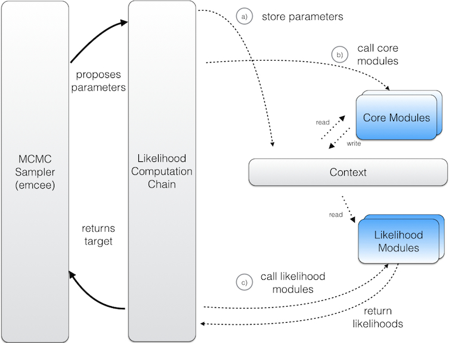

.. _HowToCosmoHammer:

How to...
=========

When using CosmoHammer for sampling your own likelihood, the central component is the LikelihoodComputationChain. As shown in the Figure, the LikelihoodComputationChain is invoked by the sampler at every position in the Monte Carlo Markov chain in order to compute the likelihood of the proposed position in parameter space. The chain itself has three components:

	

- **Context**: The context is a dictionary for storing information created during the evaluation of the likelihood. It at least contains the parameter values of the current position proposed by the sampler. 

- **CoreModules**: The CoreModules can be used to calculate information which is needed for the evaluation of the likelihood. The information can then stored in the context.

- **LikelihoodModules**: The LikelihoodModules use the information in the context to calculate the likelihood of the proposed position and return the log-likelihood to the chain.

The LikelihoodComputationChain (a) first stores the proposed parameters in the context , then (b) moves on and invokes all available CoreModules before (c) calling the LikelihoodModules. The resulting log-likelihood values are gathered, summed, and returned to the sampler. 

In the following, CoreModule and LikelihoodModule are explained in more detail.

write own CoreModules
---------------------

The minimal CoreModule is a callable module that takes only the context as an argument and has a setup routine for doing expansive calculations that can be precomputed. For every result that is to be stored in the context, you need to come up with a unique key which allows the other modules to get the information from the context. An example for such a minimal CoreModule can be found in the ``DummyCoreModule.py`` file in the examples::

	class DummyCoreModule(object):
	    """
	    Dummy Core Module for calculating the squares of parameters.
	    """
	
	    def __init__(self):
	        """
	        Constructor of the DummyCoreModule
	        """
	        pass
	        
	    def __call__(self, ctx):
	        """
	        Computes something and stores it in the context
	        """
	        # Get the parameters from the context
	        p = ctx.getParams()
	
	        # Calculate something
	        squares = p**2
	        # Add the result to the context using a unique key
	        ctx.add('squares_key', squares)
	        
	        # Store derived parameters for post processing
	        derived_parms = sum(squares) % 2
        	ctx.getData()["derived_params_key"] = derived_parms
	
	    def setup(self):
	        """
	        Sets up the core module.
	        Tasks that need to be executed once per run
	        """
	        #e.g. load data from files
	        
	        print("DummyCoreModule setup done")

write own LikelihoodModules
---------------------------

The minimal LikelihoodModule is a module with a computeLikelihood function that takes only the context as an argument and returns the likelihood and a setup routine for doing expansive calculations that can be precomputed. An example for such a minimal LikelihoodModule can be found in the ``DummyLikelihoodModule.py`` file in the examples.::

	class DummyLikelihoodModule(object):
	    """
	    Dummy object for calculating a likelihood
	    """
	
	    def __init__(self):
	        """
	        Constructor of the DummyLikelihoodModule
	        """
	        pass
	    
	    def computeLikelihood(self, ctx):
	        """
	        Computes the likelihood using information from the context
	        """
	        # Get information from the context. This can be results from a core
	        # module or the parameters coming from the sampler
	        squares = ctx.get('squares_key')
	        
	        # Calculate a likelihood up to normalization
	        lnprob = -sum(squares)/2.0
	        
	        # Return the likelihood
	        return lnprob
	    
	    def setup(self):
	        """
	        Sets up the likelihood module.
	        Tasks that need to be executed once per run
	        """
	        #e.g. load data from files
	        
	        print("DummyLikelihoodModule setup done")
