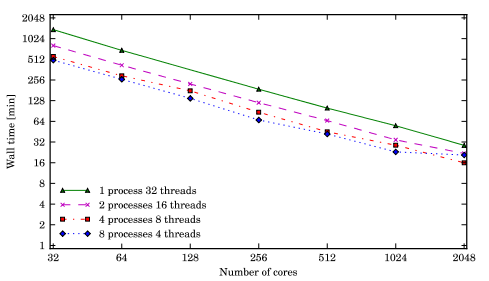

.. _benchmark:

Benchmark
============

Sampling the WMAP 7 year likelihood with CAMB required a large amount of computational power. We therefore decided to explore the possible benefits of cloud computing by means of CosmoHammer. One of the major advantages of this computing strategy is that the configuration of the cloud can be easily tailored to the problem at hand. In the cloud more computational power can be added within minutes by renting extra compute instances on demand, resulting in an optimised execution time. 

As cloud service provider we decided to use `Amazon EC2 <http://aws.amazon.com/ec2/>`_. The high performance computing cluster consisted of one master node and several worker nodes. At the moment of the benchmarks one cc2.8xlarge Instance ships with 2 × Intel Xeon E5-2670, eight-core architecture with Hyper-Threading, resulting in 32 cores per node. We used a m1.large instance as master node mainly to benefit from the high I / O performance in order to reduce the loading time of the WMAP data.

The results depicted in the figure have been realised with one to 64 worker nodes (32 - 2048 cores) and different combinations of processes and threads per node. The processes define the number of computations executed in parallel and the threads represent the number of cores used for one computation. 

As it can be seen CosmoHammer scales almost linearly with increasing number of computational cores. The best result was achieved using 64 nodes with 32 cores, four processes and eight threads. Using this configuration, the computation took about 16 Minutes. 
