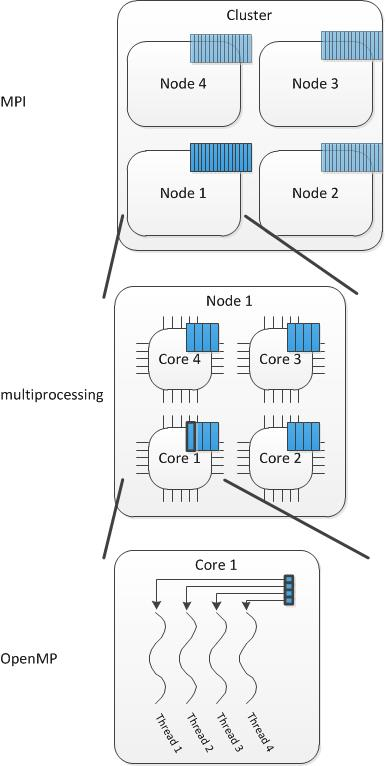

.. _parallelization:

Parallelization
===============

``CosmoHammer`` allows for parallelizing the evaluation of the likelihood from a single computer to a large scale computing environment like a compute cluster or a cloud infrastructure. 

In the simple case where ``CosmoHammer`` is executed on a single physical computer with one or multiple threads the parallelization is either solved thru `OpenMP <http://openmp.org>`_ or the built in Python `multiprocessing <http://docs.python.org/library/multiprocessing.html>`_. In the case of OpenMP the parallelization is done by executing multiple threads within a shared-memory machine. This is typically a use case when your likelihood code is written in C/C++ or FORTRAN like the theory prediction module `CAMB <http://camb.info/>`_.

With multiprocessing it is important to note that the module spawns a certain number of Python processes within a machine in order to execute the code in parallel. This causes some overhead during the parallelization process so that a performance gain is only achieved if the computations are resource demanding.

In the non-trivial case where ``CosmoHammer`` should take advantage of a computation cluster with multiple physical nodes like a cloud or grid computer the parallelization is solved by using the Message Passing Interface (MPI/`mpi4py <https://pypi.python.org/pypi/mpi4py/0.6.0>`_). This requires that mpi4py is `installed <https://pypi.python.org/pypi/mpi4py/0.6.0>`_ on your system. Note, however, that this way of parallelisation is only beneficial when the executed computations are time and resource consuming. Distributing the workload in a compute cluster always implies the transfer of information over the network which is typically slower than transferring information between local processes by an order of magnitude. Therefore, the advantage of additional computing resources and the disadvantage of the network overhead have to be weighted.

When using a compute cluster the nodes often come with a large number of computational cores. Writing code that fully benefits from such a large number of cores is usually difficult. Therefore, it makes sense to split the workload also on the node since using a smaller number of cores per computation while performing multiple computations in parallel is typically more efficient. In this case ``CosmoHammer`` helps you to combine the parallelization schemes mention above.

Examples
--------

*Parallelization of* ``CosmoHammer`` *on a* **single machine** *with n cores.*

1) Using only Python multiprocessing:
:: 
    from cosmoHammer.CosmoHammerSampler import CosmoHammerSampler
    sampler = CosmoHammerSampler(params, likelihoodComputationChain, filePrefix, 
        walkersRatio, burninIterations, sampleIterations, threadCount=n)

2) Using only OpenMP:

``$ export OMP_NUM_THREADS=n``
:: 
    from cosmoHammer.CosmoHammerSampler import CosmoHammerSampler
    sampler = CosmoHammerSampler(params, likelihoodComputationChain, filePrefix, 
        walkersRatio, burninIterations, sampleIterations)

3) Using OpenMP and Python multiprocessing (choose the the number m of OpenMP threads and the number k of multiprocessing threads such that k*m = n):

``$ export OMP_NUM_THREADS=m``
:: 
    from cosmoHammer.CosmoHammerSampler import CosmoHammerSampler
    sampler = CosmoHammerSampler(params, likelihoodComputationChain, filePrefix, 
        walkersRatio, burninIterations, sampleIterations, threadCount=k)

*Parallelization of* ``CosmoHammer`` *on a* **cluster or cloud** *with N nodes and n cores per node. For distributing the workload between different nodes in the cluster, MPI has to be used. Run your python script with:* 

``mpiexec -n $NUM ./<script>.py,``

*where $NUM>=N is the number of MPI jobs and <script> is your python script to launch the CosmoHammer. Note that $NUM cannot be greater than the number of walkers.*

1) Using only MPI: Choose $NUM=N*n when executing the python script.
:: 
    from cosmoHammer.MpiCosmoHammerSampler import MpiCosmoHammerSampler
    sampler = MpiCosmoHammerSampler(params, likelihoodComputationChain, filePrefix, 
        walkersRatio, burninIterations, sampleIterations)

2) Using MPI and OpenMP. Choose the number m of OpenMP threads such that n=k*m for some integer k. Choose $NUM=N*k when executing the python script

``$ export OMP_NUM_THREADS=m``
::
    from cosmoHammer.MpiCosmoHammerSampler import MpiCosmoHammerSampler
    sampler = MpiCosmoHammerSampler(params, likelihoodComputationChain, filePrefix, 
        walkersRatio, burninIterations, sampleIterations)

3) Using MPI, OpenMP, and Python multiprocessing. Choose the number m of OpenMP threads and the number k of multiprocessing threads such that n=k*m. Choose $NUM=N when executing the python script

``$ export OMP_NUM_THREADS=m``
:: 
    from cosmoHammer.ConcurrentMpiCosmoHammerSampler import ConcurrentMpiCosmoHammerSampler
    sampler = ConcurrentMpiCosmoHammerSampler(params, likelihoodComputationChain, filePrefix, 
        walkersRatio, burninIterations, sampleIterations, threads=k)
