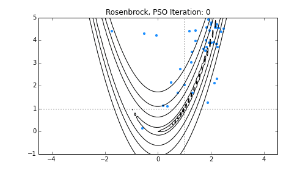

.. _pso:

Particle Swarm Optimizer
========================

The `CosmoHammer` package comes with a fully parallelized implementation of a Particle Swarm optimization (PSO) algorithm, a powerful metaheuristic optimizer introduced by Kennedy  et  al. in 2001.

The algorithm works with a set of particles, where each particle i representing a position in the parameter search space. The PSO moves these particles in the space to find the best solution while using the information contained in the swarm.

The algorithm can be used in high dimensional parameter spaces and for problems that are irregular or even noisy as it does not require the problem to be differentiable. 

The animation is showing an example usage of the PSO to find the global minima of the Rosenbrock function. The blue dots represent the particles over the iterations and the contour lines depict the target function. The dotted lines mark the analytical minima.

One use case of the PSO is to find the best starting position for a `CosmoHammer` MCMC sampling. The code for using the PSO in `CosmoHammer`would look something like this::

	import cosmoHammer
	from cosmoHammer.modules import RosenbrockModule
	
	chain = cosmoHammer.LikelihoodComputationChain()
	chain.addLikelihoodModule(RosenbrockModule())
	
	pso = cosmoHammer.ParticleSwarmOptimizer(chain, low=[-5,-5], high=[5,5], particleCount=40)
	
	#returns all swarms and the best particle for all iterations
	swarms, gbests = pso.optimize()
	
	print(gbests[-1])

